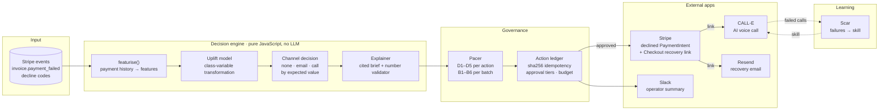
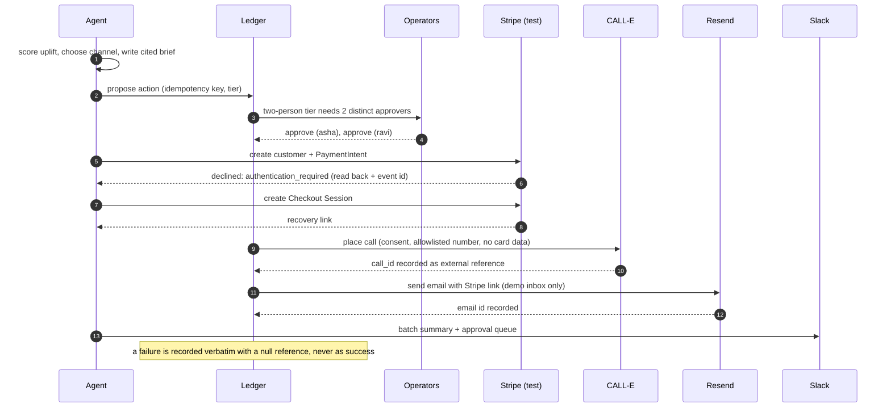
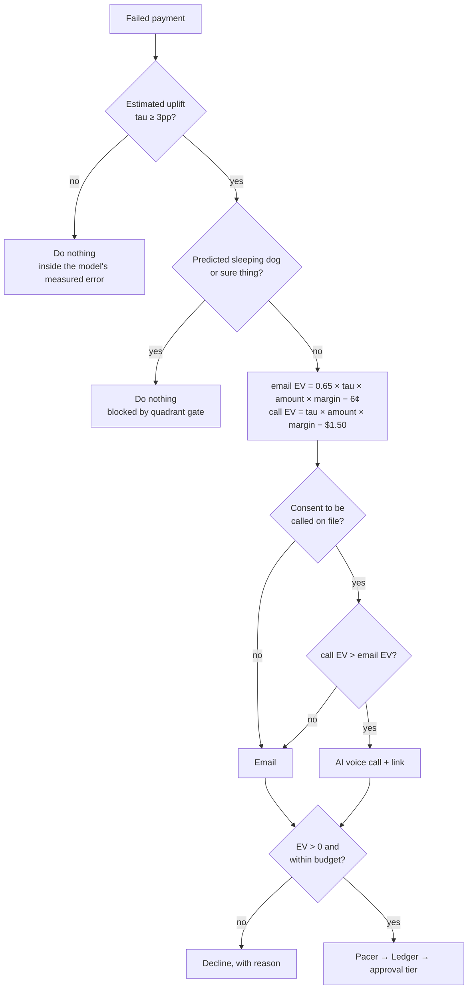
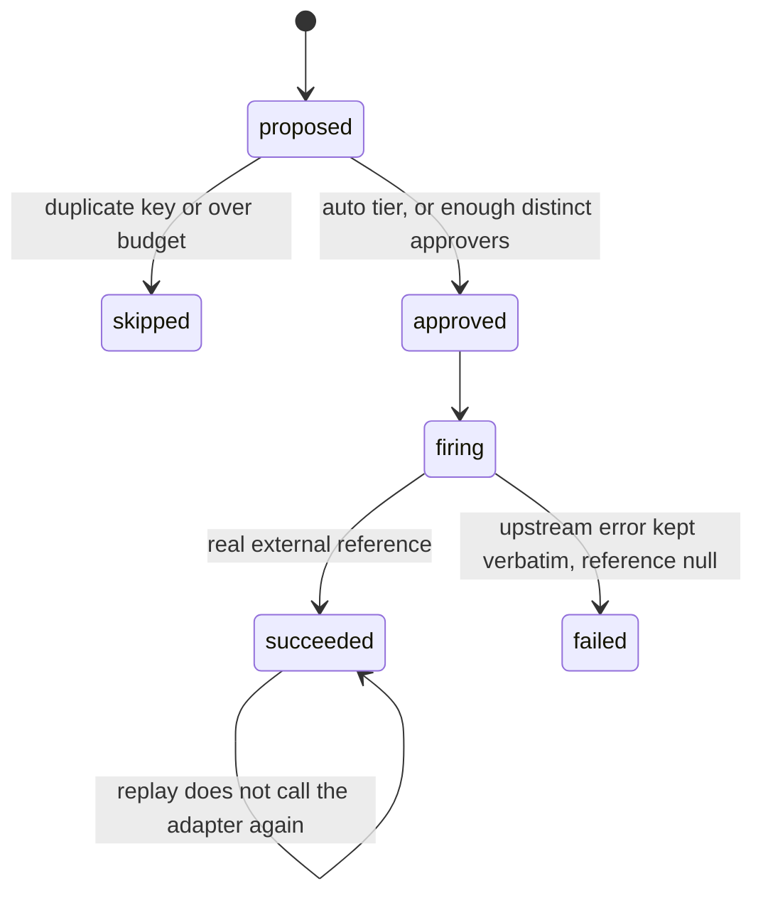
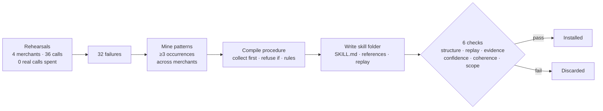

<div align="center">

# Recovery Agent

### Failed-payment recovery on Stripe that knows who **not** to contact, and when an AI voice call is worth paying for.

[](#live-proof)
[](#live-proof)
[](#live-proof)
[](#live-proof)
<br/>
[](#testing)
[](#testing)
[](#quick-start)
[](#quick-start)
[](LICENSE)

**+$2,521** net margin vs doing nothing · **+$391** vs emailing everyone, with **30% fewer contacts** · **4 external apps, all verified live**

</div>

---

## Contents

1. [The problem](#1-the-problem)
2. [What the agent does](#2-what-the-agent-does)
3. [Architecture](#3-architecture)
4. [How a decision is made](#4-how-a-decision-is-made)
5. [Results](#5-results)
6. [Live proof: the four external apps](#live-proof)
7. [Safety and governance](#7-safety-and-governance)
8. [Learning from failed calls: Scar](#8-learning-from-failed-calls-scar)
9. [Quick start](#quick-start)
10. [Configuration](#10-configuration)
11. [Testing](#testing)
12. [Repository layout](#12-repository-layout)
13. [Limitations, stated plainly](#13-limitations-stated-plainly)
14. [Credits](#14-credits)

---

## 1. The problem

### A story every subscription business knows

> *The company and the people below are an illustration, not a customer.*

It is the 1st of the month at **Acme Cloud**, a small SaaS company with a few thousand subscribers. Overnight, Stripe
tries to renew every subscription. By morning, **three hundred payments have failed.**

Nobody on the team decided to lose those customers. Cards expired. Banks asked for a 3-D Secure check that nobody
saw. A bank's systems were briefly down. Some cards are simply empty. This is **involuntary churn**: revenue that
walks out the door without anyone choosing to leave.

Maya runs billing, and she has the tool every company has: **dunning**, a reminder sequence sent to everyone whose
payment failed. It feels responsible. It is quietly expensive in three ways she can't see:

1. **Daniel** would have paid anyway. His bank was down for twenty minutes, and Stripe's automatic retry would have
   succeeded the next day. Maya paid to remind someone who needed no reminder.
2. **Sofia** has been a customer for three years and hates being chased. The third "your payment failed" email
   arrives while she is comparing competitors. She cancels. **Maya paid to lose a loyal customer.**
3. **Arjun** genuinely wants to pay. His card expired and he needs a clear, secure way to update it. The generic
   email went to spam. He is the one person worth reaching, and the broad campaign missed him.

Now the team hears about **AI voice agents** that can phone customers. It sounds like the fix. But a call costs about
**25 times** an email, and handing an autonomous agent your customers' phone numbers and payment problems brings new
risks.

### What can go wrong: the risks this project had to take seriously

| # | Risk | What it looks like in practice | Who gets hurt |
| --- | --- | --- | --- |
| R1 | **Wasted spend** | Contacting customers who would have paid anyway | The business's margin |
| R2 | **Chasing causes churn** | Reminders and calls push chase-averse customers to cancel | Revenue and relationships |
| R3 | **Calls where email would do** | An AI call costs about 25× an email for the same outcome | The business's margin |
| R4 | **Calling without consent** | Automated calls to people who never agreed to them, which can be illegal in many places | The customer, and the company legally |
| R5 | **Card details taken by voice** | An agent asks for a card number on the phone, putting card data in call transcripts | The customer, and compliance with card-security rules (PCI) |
| R6 | **Disclosing to the wrong person** | The amount owed is left on voicemail or told to a family member | Customer privacy |
| R7 | **Invented facts** | A language model states the wrong amount, or a reason nobody measured | Trust; possible disputes |
| R8 | **Double contact or double charge** | A retry or re-run fires the same action twice | The customer |
| R9 | **Runaway spend** | An agent keeps calling with no budget or stopping rule | The business |
| R10 | **Fake success** | A failed API call gets logged as sent, so the audit trail lies | Everyone who relies on the log |
| R11 | **A model that doesn't work** | Targeting that is no better than random, or confident predictions that don't hold up | Every decision downstream |
| R12 | **Unanswered or unresolved calls** | The call reaches voicemail, someone else answers, or the customer disputes the charge | The customer experience |

### The question we set out to answer

The usual question, *"who is likely to pay?"*, is **propensity**, and it ranks Daniel first. The right question is:

> **Who pays *because* we acted? And for them, is the extra recovery from a call worth the price of the call?**

```
tau(x) = P(recover | contacted, x) − P(recover | left alone, x)        ← the incremental effect (uplift)
```

### How this agent answers each risk

| Risk | Our answer | Where it lives | How it is proven |
| --- | --- | --- | --- |
| R1 Wasted spend | Estimate **uplift**, not propensity; do nothing when the effect is below the model's measured error (3pp) | `uplift.mjs`, `recover.mjs` | 57% of self-recoverers are contacted and **0% are called** (table in §5) |
| R2 Chasing causes churn | Block predicted "sleeping dogs"; pacer rule **B4** halts a batch that contacts any | `pacer.mjs` | 0% of chase-averse customers called; **37% still emailed**, reported as an open weakness |
| R3 Calls where email would do | Choose the channel by **expected value**: a call must beat email *after* its extra cost | `recover.mjs` `decide()` | Calling everyone is the worst contact policy: +$1,396 vs the agent's +$2,521 |
| R4 No consent | No consent, no call, enforced twice: in the decision and in pacer rule **D5**; dial only allowlisted numbers | `calle.mjs`, `pacer.mjs` | Tests: refused before any network request |
| R5 Card data by voice | **Refuse any call script that collects card details**; the customer pays only on Stripe's own page | `calle.mjs`, `email.mjs` | Test: a card-collecting script is rejected |
| R6 Wrong person | The call script requires identity confirmation first, and leaves nothing about money on voicemail | `calle.mjs` | Script carries all 6 safety rules (test); rehearsed by Scar |
| R7 Invented facts | Numbers come from code; every sentence is checked against evidence; an optional LLM may only rephrase | `explain.mjs` | **0 unsupported claims** dropped on the run |
| R8 Double action | sha256 idempotency key checked in our own ledger **before** the API call; Stripe `Idempotency-Key` on every request | `policy.mjs`, `stripe.mjs` | Tests: a replayed action never calls the adapter again |
| R9 Runaway spend | A hard budget, approval tiers, and **two distinct people** for large amounts | `policy.mjs`, `pacer.mjs` | Tests: budget stops mid-batch; the same approver twice is rejected |
| R10 Fake success | Failures recorded verbatim with a null reference; "success" without a reference counts as failure | `policy.mjs` | Tests; every LIVE row in §6 shows its real reference |
| R11 Model that doesn't work | Qini on held-out data; calibration by decile; pacer **B5** halts if the model is no better than random | `calibration.mjs`, `pacer.mjs` | Qini 31.1; calibration error 2.97pp, rank correlation 0.916 |
| R12 Unresolved calls | A structured call result (`answered_by`, `outcome`, `evidence_quote`), read back after the call; **Scar** learns from repeated failures | `calle.mjs`, `scar/` | First live call honestly recorded as `no_answer`; Scar skill 32/32 in rehearsal |

### What we have proven, and for whom

This is a hackathon build, so we are precise about what is proven:

- **Proven end to end on live systems, for one demo merchant.** In a single live run for *Acme Cloud*, a fictional
  merchant, with Stripe in test mode: Stripe really declined the payments, the recovery links were real Stripe
  Checkout pages, CALL-E placed the call, Resend delivered the email and Slack received the summary. Every step
  returned a real reference id (§6).
- **Proven on a measured batch.** On 3,109 synthetic failed payments shaped like Stripe data, the agent beat every
  baseline on held-out data (§5).
- **Not yet proven:** results on a real company's customers. No real merchant's data or customers were used. That
  is the next step, and `featurise()` is built to take real Stripe events unchanged.

---

## 2. What the agent does

For each batch of failed payments, one command runs eight stages:

| # | Stage | What happens |
| --- | --- | --- |
| 1 | **Detect** | Reads failed payments in Stripe's own shapes: `invoice.payment_failed`, real decline codes, amounts in cents |
| 2 | **Qualify** | An uplift model estimates each customer's incremental effect. It is trained on a prior randomised recovery test. |
| 3 | **Decide** | Picks **do nothing**, **email** or **AI voice call** by expected value. A call needs consent on file. |
| 4 | **Measure** | Scores the agent against five baselines on a held-out split, at the same contact volume |
| 5 | **Govern** | Pure safety rules and a budget gate every action. A ledger enforces idempotency and approval tiers. |
| 6 | **Audit** | Every decision gets a written brief, and every number in it is checked against evidence |
| 7 | **Act** | Stripe creates the recovery link, CALL-E calls or Resend emails, and Slack notifies the operators |
| 8 | **Learn** | Scar turns repeated call failures into a tested, installable skill for the next call |

---

## 3. Architecture

### System overview



### One live recovery, end to end



### Design principles

| Principle | Why |
| --- | --- |
| **Arithmetic in code, never in a prompt** | Money decisions come from JavaScript you can test. A language model is optional and may only rephrase sentences. Any rewrite that changes a number is rejected. |
| **Refuse before the request, not after** | Live Stripe keys, calls without consent, numbers not on the allowlist and scripts that collect card details are all rejected before any network call. Tests prove it with the network switched off. |
| **Never invent a success** | If an adapter fails, or "succeeds" without returning a reference, the action is recorded as failed, with the upstream error kept word for word. |
| **Zero dependencies** | Node's built-in `fetch` and `crypto` only. Nothing to install, and no supply chain to audit. |

---

## 4. How a decision is made



**When a call wins:** when `(1 − 0.65) × tau × amount × margin > $1.50 − 6¢`. That is a persuadable customer on a
large invoice. On a small invoice, a call loses even when the customer is very persuadable.

**The 3pp floor** is the model's own measured calibration error (2.97pp on held-out data). Below it the model cannot
tell a real effect from zero, so the agent won't spend money on it.

### Every decision is explained, and every number is checked

```
C7747  CONTACT — AI voice call
    Payment of $132.43 was declined (authentication required), after 3 attempt(s). Left alone,
    this customer recovers 22% of the time. Contacting them lifts recovery to 54%, an incremental
    +32.1pp. A voice call is worth $24.04 here against $16.54 for an email, because a call captures
    the whole effect and an email only part of it. Requires two-person approval.
    evidence: decline code authentication required · effect 32.1pp · recovers unprompted 22% ·
              consent on file · EV $24.04 · other channel $16.54

claims dropped for unsupported numbers: 0   (every sentence traces to evidence)
```

A validator drops any sentence that contains a number not found in the evidence list.

---

## 5. Results

**Setup:** 9,000 synthetic customers, with 3,109 failed payments ($90,716 at risk) and real Stripe decline codes. The
model trains on half the data, from a prior randomised test. Every policy is scored on the other half against true
outcomes. The ranking baselines get **the same channel logic as the agent**, so the table isolates *who* gets contacted.

| Policy | Contacted | Calls | Recovered | Spent | Net margin | vs nothing |
| --- | ---: | ---: | ---: | ---: | ---: | ---: |
| Contact nobody | 0 | 0 | 496 | $0.00 | $9,218 | — |
| Email everyone (typical dunning) | 1,555 | 0 | 618 | $93.30 | $11,348 | +$2,130 |
| Everyone, call if allowed | 1,555 | 1,080 | 664 | $1,649 | $10,614 | +$1,396 |
| Propensity top 1,096 | 1,096 | 196 | 628 | $348.00 | $11,455 | +$2,237 |
| Uplift top 1,096 (no gates) | 1,096 | 232 | 646 | $399.84 | $11,739 | +$2,521 |
| **This agent (gated)** | **1,096** | **232** | **646** | **$399.84** | **$11,739** | **+$2,521** |

### What it means

- **+$391 over emailing everyone**, the strongest blanket baseline, with **30% fewer contacts**.
- **+$284 over propensity targeting** at the same contact volume.
- **Calling everyone is the worst contact policy.** It spends $1,556 more than emailing everyone to recover only 46 more payments.
- **Qini 31.1** on the held-out split, where 0 means no better than random.

### Who got contacted (the model never saw these labels)

| Hidden type | Customers | Contacted | Called | True effect of contact |
| --- | ---: | ---: | ---: | ---: |
| Needs a nudge | 518 | 100% | **38%** | +33.0pp |
| Card or funds dead | 383 | 65% | 9% | +5.5pp |
| Self-recoverer | 431 | 57% | **0%** | +2.0pp |
| Chase-averse | 223 | 37% | **0%** | −11.5pp |

Calls go to the customers they help. No self-recoverer or chase-averse customer gets a call.

### Calibration

| Deciles usable | Mean absolute error | Bias | Rank correlation | Verdict |
| ---: | ---: | ---: | ---: | --- |
| 10 of 10 | 2.97pp | 1.41pp | 0.916 | **Well calibrated** |

The calibration tool refuses to print a number for any decile too thin to support one.

---

<a id="live-proof"></a>

## 6. Live proof: the four external apps

All four apps returned real responses in a live run on **2026-09-14**, with Stripe in test mode. Every reference
below is copied from that run's `INTEGRATIONS` output.

| App | Role | Live result | Reference |
| --- | --- | --- | --- |
| **Stripe** | Source of the failure, and the recovery link | 2 customers; 2 PaymentIntents **declined by Stripe itself with `authentication_required`**, read back with their event ids; 2 Checkout Sessions | `pi_3UFL6t3KGHkj4q0e0eZqDCZI` · `evt_3UFL6t3KGHkj4q0e05s99IVG` |
| **CALL-E** | AI voice call to the customer | Call placed after two distinct approvals | `call_NjZaL57MP3RCnC3RF_VYiA` |
| **Resend** | Recovery email | Delivered to the demo inbox with a working Stripe Checkout link | `11e7a738-7945-4690-85ae-ce798d7149bb` |
| **Slack** | Operator notification | Batch summary and approval queue posted | HTTP 200 `ok` |

> **What the call proves, precisely:** CALL-E accepted and placed the call. On that first test **nobody answered**
> (`answered_by: no_answer`). You can read back a call's outcome with `npm run call:status -- <call_id>`.

### What each integration enforces

| App | Safeguards (all enforced in code) |
| --- | --- |
| **Stripe** | Refuses `sk_live_` keys before any request · sends an `Idempotency-Key` on every POST, so a re-run never creates duplicates · retries only on 429 and 5xx · verifies webhook signatures (`Stripe-Signature`) with replay tolerance and a constant-time comparison |
| **CALL-E** | No consent, no call · dials only allowlisted numbers, masked in logs · **refuses any call script that collects card details (PCI)** · the script makes the agent say it is automated, confirm identity before discussing money, leave nothing on voicemail, honour opt-outs and pass disputes to a human |
| **Resend** | Sends only to `DEMO_EMAIL`, never to a customer address · never asks for card details; the card is entered only on Stripe's page |
| **Slack** | Notification only · a webhook can't tell who clicked, so it never approves anything |

---

## 7. Safety and governance

### The pacer: pure rules, no model calls

**Halts are checked before nudges.** The first version checked a warning first and returned early, so an action
with no arithmetic *and* a negative uplift slipped through as a warning. That bug is fixed and covered by a test.

| Rule | Kind | Fires when |
| --- | --- | --- |
| D5 | **halt** | an AI voice call has no consent on file |
| D2 | **halt** | contact is proposed for a negative estimated effect |
| D4 | **halt** | expected value ≤ 0 |
| D1 | nudge | a call's brief shows no arithmetic |
| D3 | nudge | effect inside the noise band |
| B1 | **halt** | batch has no budget |
| B2 | **halt** | spend exceeds budget |
| B4 | **halt** | any predicted sleeping dog is contacted |
| B5 | **halt** | Qini ≤ 0 (no better than random) |
| B3 | nudge | more than 15% of contacts are sure things |
| B6 | nudge | nothing rejected (gates not binding) |

When the same rules are run over the propensity list, they **halt 179 actions**.

### The action ledger



| Tier | Invoice amount | Approvals |
| --- | --- | --- |
| Auto | ≤ $25 | 0 |
| One-click | ≤ $100 | 1 |
| Two-person | > $100 | **2 distinct people.** The same person approving twice is rejected. |

---

## 8. Learning from failed calls: Scar

Phone agents fail the same way twice. [`scar/`](scar/) watches recovery calls fail, finds the repeated pattern and
writes the fix as an installable skill. It **refuses to trust that skill until the skill handles the failures that
produced it.**



**Result:** skill `failed-payment-recovery-call`, **ACCEPTED with 6/6 checks passing.** A naive call plan handles
**0/32** failures; with the skill it handles **32/32**.

What it learns:
- Bring the invoice number, amount, date and payment link into the call.
- Leave nothing sensitive on voicemail.
- Confirm identity before discussing money.
- **Never take card numbers by voice.**
- Stop calling when asked.
- Hand disputes to a human.

---

<a id="quick-start"></a>

## 9. Quick start

**Requirements:** Node.js 22.18 or newer. **Nothing to install**, because there are no dependencies.

```bash
git clone https://github.com/Ariya-rithvik/recovery-agent.git
cd recovery-agent
npm run demo
```

This runs the whole pipeline **offline, with no keys**, in about a second.

### Run it live

```bash
cp .env.example .env                        # add the keys you have (see Configuration)
npm run live -- --approvers=asha,ravi       # two approvers unlock the two-person tier
npm run call:status -- <call_id>            # read back a call's outcome
```

On Windows, double-click **`demo.cmd`** for a menu. It sets the console to UTF-8 first.

Every run writes **`out/run.json`**, which holds the results table, pacer verdicts, integration status and the full ledger audit trail.

---

## 10. Configuration

Every variable is optional. A missing key shows as `NOT SET` in the output instead of crashing the run.

| Variable | Where to get it | Unlocks |
| --- | --- | --- |
| `STRIPE_SECRET_KEY` | [Stripe dashboard → API keys](https://dashboard.stripe.com/test/apikeys), test mode | Real declined payments and Checkout recovery links |
| `RESEND_API_KEY` | [resend.com/api-keys](https://resend.com/api-keys) | Recovery email |
| `DEMO_EMAIL` | Your Resend signup address | The only inbox that receives mail |
| `CALLE_API_KEY` | [heycall-e.com](https://heycall-e.com) | AI voice calls |
| `DEMO_PHONE` / `CALLE_ALLOWED_NUMBERS` | Your own number, with country code | The only numbers ever dialled |
| `SLACK_WEBHOOK_URL` | [api.slack.com/apps](https://api.slack.com/apps) → Incoming Webhooks | Operator notifications |
| `CALL_COST_CENTS` | Your CALL-E rate (default 150) | The call-vs-email decision |
| `MERCHANT_NAME` | Any name (default "Acme Cloud") | Wording in calls and emails |

`.env` is gitignored and has never been committed.

---

<a id="testing"></a>

## 11. Testing

```bash
npm test               # 69 safety properties
npm run demo:check     # the full runbook with all 14 environment variables deleted
npm run calibrate      # predicted vs delivered uplift, by decile
npm run bench          # the same method applied to a Stripe coupon decision
npm run learn          # Scar, human-readable
```

| Suite | Passing | Covers |
| --- | ---: | --- |
| Ledger | 25 | idempotency, approval tiers, distinct approvers, budget stop, verbatim failure |
| Pacer | 20 | every rule, idempotency, halts-before-nudges ordering |
| Adapters | 24 | Stripe signatures and encoding, live-key refusal, consent, allowlist, PCI guard, demo-inbox guard. **Runs with the network disabled**, and each guard asserts no request was sent. |
| **Demo check** | **11/11** | the demo, tests, calibration, benchmark and Scar; `--live` with no keys (every app reports `NOT SET`); a live Stripe key refused; no leftover text from earlier versions |

---

## 12. Repository layout

```
recovery-agent/
├── src/
│   ├── recover.mjs          the pipeline: detect → qualify → decide → measure → govern → audit → act → learn
│   ├── twin.mjs             synthetic customers in Stripe event shapes; featurise()
│   ├── uplift.mjs           uplift model (class-variable transformation), Qini, quadrants
│   ├── calibration.mjs      predicted vs delivered, by decile
│   ├── explain.mjs          cited briefs and the number validator
│   ├── pacer.mjs            governance rules (pure)
│   ├── policy.mjs           action ledger: idempotency, tiers, verbatim failure
│   ├── stripe.mjs           Stripe REST: preflight, mirrored declines, Checkout, webhooks
│   ├── calle.mjs            CALL-E: call script, result schema, consent / allowlist / PCI guards
│   ├── email.mjs            Resend
│   ├── slack.mjs            Slack webhook
│   ├── money.mjs            cents → "$1.50", in one place
│   ├── bench.mjs            the same method on a coupon decision
│   └── *.test.mjs           69 tests
├── scar/                    learning from failed calls (TypeScript, runs natively)
│   └── generated/failed-payment-recovery-call/    the learned skill
├── tools/demo-check.mjs     the full runbook with zero keys
├── docs/DEMO.md             3-minute demo script
├── demo.cmd                 Windows launcher
└── .env.example             every setting, documented
```

---

## 13. Limitations, stated plainly

| Limitation | Detail |
| --- | --- |
| **The customers are synthetic** | They are generated in Stripe's own event shapes, so `featurise()` accepts real Stripe data unchanged. Only the sample rows in the live run touched real APIs. |
| **37% of chase-averse customers still get an email** | The model estimates a positive effect for them. This is the largest known error. None of them gets a call. |
| **The gates added no margin on this run** | The gated agent and the plain uplift ranking choose the same customers. The gates are there for safety: they halt 179 actions on the propensity list. |
| **Two inputs are assumptions** | The call cost ($1.50) and the share of the effect an email captures (65%). A two-arm test would measure the split. |
| **Scar rehearses against a modelled callee** | 32/32 shows the learning loop works, not how real customers behave. The wording of each rule is written by hand for each failure type. |
| **The first live call was not answered** | CALL-E placed it, and the recorded outcome is `no_answer`. |

We did not tune the model until it passed. The 3pp floor was set from the calibration error before this table was
read. Without the floor, 51% of chase-averse customers were contacted.

---

## 14. Credits

- **Governance patterns:** pure pacer rules, the pre-call idempotency ledger, verbatim failure and cited briefs come from
  **[Manthan](https://github.com/akash-mondal/manthan)**, our team's dispute-investigation agent for Stripe. They were
  reimplemented here. Manthan investigates a dispute *after* it happens; this agent decides *before* anyone is
  contacted. No Manthan code ships in this repository.
- **Uplift engine, ledger and pacer:** first written by us for an earlier hackathon entry on a different payment
  provider, then ported to Stripe.
- **Scar and the CALL-E adapter:** began as our CALL-E project.
- **Uplift estimator:** class-variable transformation (Jaskowski & Jaroszewicz, 2012).

Released under the [MIT License](LICENSE).
